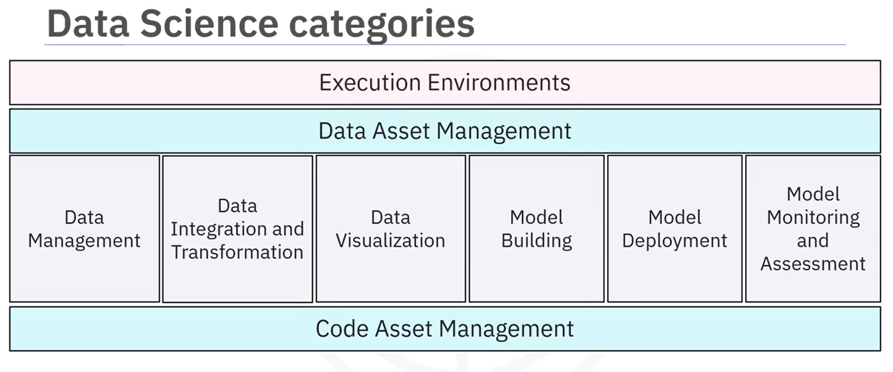
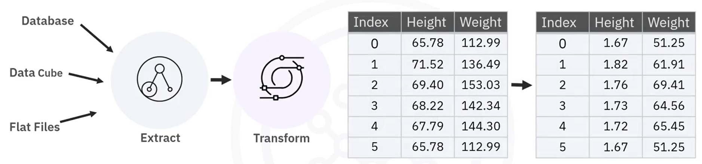

# Tools for Data Science

---

## Learning Objectives
1. **Describe the components of a Data Scientist's toolkit and list various tool categories.**
2. **List examples of open-source tools used in data science.**
3. **Describe the relevant features of open-source tools.**
4. **List examples of commercial and cloud-based data science tools.**

---

## Components of a Data Scientist's Toolkit

   
   
A Data Scientist's toolkit includes tools and platforms for:
1. **Data Management:** Collecting, storing, and retrieving data securely and efficiently.
2. **Data Integration and Transformation:** Extracting, transforming, and loading (ETL) data for analysis.
 **ETL Process:**
   
   *Illustrates the steps of Extracting, Transforming, and Loading data.*
3. **Data Visualization:** Representing data graphically to identify patterns and trends.
4. **Model Building:** Training machine learning models to make predictions.
5. **Model Deployment:** Integrating models into production environments.
6. **Model Monitoring and Assessment:** Ensuring model accuracy and performance over time.

---

## Categories of Data Science Tools

### 1. **Open-Source Tools**
- **Definition:** Free tools with publicly available source code, allowing customization and community contributions.
- **Examples:**
  - **Jupyter Notebook:** Interactive environment for coding, visualization, and documentation.
  - **RStudio:** IDE for statistical computing and graphics in R.
  - **Apache Spark:** Distributed data processing engine for big data analytics.
  - **TensorFlow:** Open-source library for deep learning and machine learning.
- **Features:**
  - Cost-effective and community-driven.
  - Highly customizable and extensible.
  - Large community support and frequent updates.

---

### 2. **Commercial Tools**
- **Definition:** Proprietary tools developed by companies, often with advanced features and dedicated support.
- **Examples:**
  - **IBM SPSS:** Statistical analysis software for data mining and predictive analytics.
  - **MATLAB:** High-performance computing for numerical analysis and visualization.
  - **Tableau:** Data visualization tool for creating interactive dashboards.
- **Features:**
  - User-friendly interfaces.
  - Dedicated customer support.
  - Advanced features for enterprise use.

---

### 3. **Cloud-Based Tools**
- **Definition:** Tools hosted on cloud platforms, offering scalability and accessibility from anywhere.
- **Examples:**
  - **Google Colab:** Cloud-based Jupyter Notebook with free GPU/TPU support.
  - **AWS SageMaker:** End-to-end machine learning service for building, training, and deploying models.
  - **Microsoft Azure Machine Learning:** Cloud platform for developing and deploying machine learning models.
- **Features:**
  - Scalability for large datasets and workloads.
  - Pay-as-you-go pricing models.
  - Collaboration features for distributed teams.

---

## Popular Examples of Data Science Tools

### Open-Source Tools
| Tool            | Purpose                        | Key Features                                   |
|------------------|--------------------------------|-----------------------------------------------|
| Jupyter Notebook | Coding, visualization, docs   | Interactive, supports multiple languages      |
| RStudio          | Statistical computing         | IDE for R, supports advanced statistical tools|
| TensorFlow       | Machine learning, deep learning| Scalable, supports neural networks           |
| Apache Spark     | Big data processing           | Distributed, fast in-memory computation       |

### Commercial Tools
| Tool            | Purpose                        | Key Features                                   |
|------------------|--------------------------------|-----------------------------------------------|
| IBM SPSS         | Statistical analysis          | Predictive analytics, user-friendly interface |
| Tableau          | Data visualization            | Drag-and-drop interface, interactive dashboards|
| MATLAB           | Numerical analysis            | High-performance computing, visualization     |

### Cloud-Based Tools
| Tool            | Purpose                        | Key Features                                   |
|------------------|--------------------------------|-----------------------------------------------|
| Google Colab     | Cloud-based coding            | Free GPU/TPU, Jupyter Notebook integration    |
| AWS SageMaker    | Machine learning              | End-to-end ML pipeline, scalable infrastructure|
| Azure ML         | Machine learning              | Model training, deployment, and monitoring    |

---

## Visual Representation (Example Images)
1. **Open-Source Tools:**
   - Screenshot of Jupyter Notebook interface.
   - Diagram of TensorFlow architecture.
2. **Commercial Tools:**
   - Example Tableau dashboard.
   - IBM SPSS interface for predictive analytics.
3. **Cloud-Based Tools:**
   - Google Colab interface with code and output.
   - AWS SageMaker workflow diagram.

---

## Summary
- **Open-Source Tools:** Cost-effective, community-driven, and customizable (e.g., Jupyter Notebook, TensorFlow).
- **Commercial Tools:** Proprietary tools with advanced features and support (e.g., Tableau, IBM SPSS).
- **Cloud-Based Tools:** Scalable and accessible tools for distributed teams (e.g., Google Colab, AWS SageMaker).
- Data scientists use a combination of these tools to manage data, build models, and derive insights effectively.
